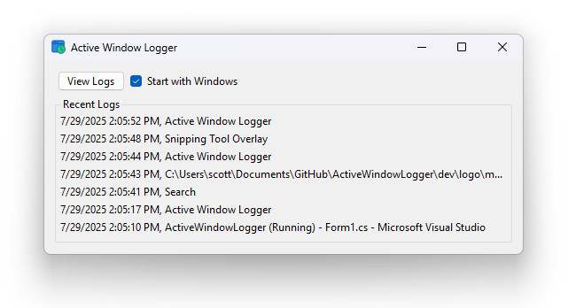

#  Active Window Logger 

**Active Window Logger is a Windows Application that lives in the system tray and monitors computer activity based on active window name.** Many similar projects exist, but this one is open-source and aims to be as minimal as possible to facilitate customization. 

* **Download:** * [ActiveWindowLogger.exe](https://github.com/swharden/ActiveWindowLogger/releases/latest) (Latest Release)

## Design Goals

* Single file EXE
* No installation required
* Log data as daily CSV files
* Application is a system tray icon
* Automatically start with Windows
* Totally separate analysis application
* Never monitor key presses to maximize security

## Download
* Download: [Active Window Logger](https://github.com/swharden/ActiveWindowLogger/releases/latest) (Latest Release)

## Similar Projects
* [ActivityWatch](https://activitywatch.net/) - A similar project with extensive features, but has a database structure that is complex and keeps getting silenced by my antivirus system.
* [Tockler](https://tockler.trimatech.dev/) is a cross-platform application for tracking working time using active window and other metrics.
* [OwlWindowLogger](https://github.com/seanbuscay/owlwindowlogger) - A similar project using Python. Because of the weight of the Python interpreter, I prefer not to use this approach.
* [Active Window Logger](https://github.com/TheCodeArtist/Active-Window-Logger) by Chinmay aims to log active windows but uses Visual Basic